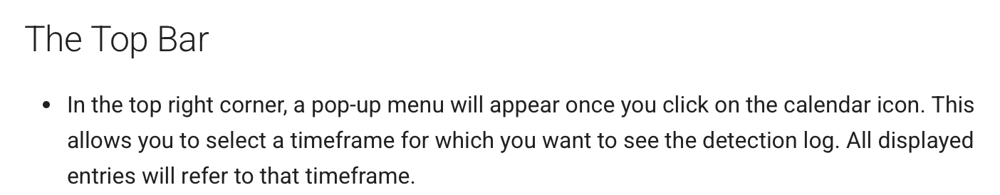

# **Detection Details**

The Detection Details section is automatically generated by the BCMS system. It captures and logs all bird detections, providing comprehensive data for analysis and decision-making. Unlike other registers that require manual input, the detection register is continuously updated in real-time by the system.

## The Top Bar

- In the top right corner, a pop-up menu will appear once you click on the calendar icon. This allows you to select a timeframe for which you want to see the detection log. All displayed entries will refer to that timeframe.
- In the top left corner, you can click on the printer icon to print out all displayed entries, or you can use the download function to generate an xlsx, odf or pdf file of the entries for offline use.
- In the top-right corner, the two-arrow icon resets table filters to their default value, whereas the grid icon allows you to select the columns you would like to be displayed in the log.
- Once the log is displayed, you can use the first row of the table to order, search and filter results according to the available options.

## Demo – Detection Flow

<iframe 
    src="https://app.sharefable.com/embed/demo/demo-detections-rjmqf50070xgfv8t"
    width="100%" 
    height="600" 
    style="border: none; border-radius: 8px;"
    allowfullscreen>
</iframe>

## The Log

The log can provide the following pieces of information with respect to the displayed events, these can be displayed according to what is checked in the grid-icon pop-up menu (see above).

- **Server time**: Date and time in which the event was logged on the server
- **Fv**: allows you to mark an event as favourites
- **ID**: Unique ID for the event
- **Event ID**: Unique ID for the event used by the backend
- **Created at**: Date and time of the creation of the event.
- **Site**: if the installation has several sites, you can filter them here
- **Camera**: the camera that recorded the event
- **Local Risk Index**: the risk index is calculated automatically based on species, number of birds, position, and flight direction. The index is color-coded (e.g., blue for low, red for very high) to provide an immediate visual indication of risk.
- **Expert label**: If, in the edit page of the event (end of the row, blue edit icon) someone has marked the event as correct or incorrect (e.g. wrong specimen), the result will be indicated here.
- **Species**: the species of the speciments detected, if available. The system automatically classifies detected birds to the species level. If a bird is too far or not in the database, it may be marked as unidentified. Non-bird objects, such as drones, are also detected and classified by the system as other objects.
- **Sector**: the sector where the event occurred
- **Event**: whether the specimens involved were standing or flying
- **Number**: number of detections in the event
- **Speed**: movement speed
- **Height**: height of the detections (measured from ground level, except in wind parks where it is measured from sea level)
- **Deterrent** **Action**: deterrent systems activated / not activated
- **Lat/Lng**: each detection is mapped with precise geographical coordinates (latitude and longitude), providing exact location data for every event.
- **Viewed** **by**: who (user) viewed that event in detail.
- **Edit** **by**: who (user) edited that event
- **Camera icon**: opens the video viewer
- **Edit icon**: allows users to manually edit the event

A double click on any log entry will open a pop-up where all data in code is presented. This can be copied or downloaded.

